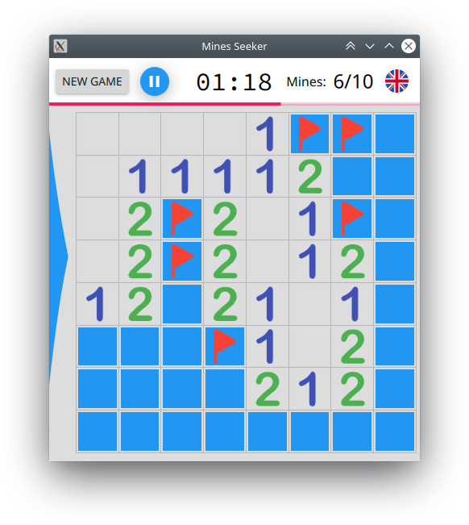

# MinesSeeker

*Copyright (C) 2018 - Carlos Enrique Pérez Sánchez*

**MinesSeeker is a minesweeper-like game.**

This minesweeper it's a school project. It uses Qt: QML for the UI, and C++ for the logic. Can be compiled to all major desktop platform and (maybe, not tested yet) for Android and iOS. It has been extensively tested on Windows and Linux for several users on my school. I haven't tested it on a Mac yet.  
Enjoy!

-----------------------------------------------------------------------------------------------------------------------------------

## Build instructions
The minimal required Qt version is Qt 5.12.0. You can build it by opening the project file in Qt Creator and clicking the *Build* button, or by passing the same project file to the `qmake` tool. Currently, there is no official support for CMake, but as Qt 6 build system will be based on CMake, MinesSeeker will support CMake soon.

-----------------------------------------------------------------------------------------------------------------------------------

***Contact info:*** `thecrowporation@gmail.com`
